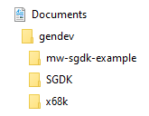

# MegaWiFi API example compiled for SGDK

This project is a modification of my [MegaWiFi API example](https://github.com/doragasu/mw-api), in order for it to build against the popular [SGDK development kit](https://github.com/Stephane-D/SGDK). Go to the API example repository to get more information, and to browse the MegaWiFi API.

# Instructions

You will need a m68k cross compiler with C standard library support. The most popular choice to fulfill these requirements, is GCC compiled against newlib. Basically what you need to do is install the compiler, build SGDK library with newlib enabled, and then build the example in this repository. I have created a tutorial for Windows users, and some guidelines for Linux users. So you have to choose your destiny.


## Lazy Windows users

So you are a lazy (or busy) Windows user. Then this step by step guide is for you.

### Prerequisites

You need java installed, and some archive manager capable of extracting 7z files ([7zip is recommended](https://www.7-zip.org/)). If you do not have your favorite git client installed, it is also highly recommended (but not mandatory since you can download repositories as ZIP files). Other than that, you should be ready to go.

### Getting the sources and toolchain

Create the folder `gendev` inside your `Documents` folder. Then go to `gendev` folder and download there [this newlib enabled m68k-elf toolchain by @PaspallasDev](win-sdk/x68k-gcc-9.3.7z). Extract it, so you have a directory `Documents\gendev\x68k`, that inside has the compiler (`bin`, `include`, `lib`, etc. directories).

Now clone [SGDK](https://github.com/Stephane-D/sgdk) and [this MegaWiFi example repo](https://github.com/doragasu/mw-sgdk-example) into the `gendev` folder (or alternatively, download them as ZIP file and extract them there). You can get rid now of the 7z (and maybe ZIP) archive you downloaded, and keep the extracted files. So far your directory tree should look like this:



We are now ready to start building things.

### Building SGDK with newlib

First we have to set the proper environment. Edit [Documents\gendev\mw-sgdk\example\env.bat](env.bat). Replace the first line:

```
set "GENDEV=C:/users/doragasu/Documents/gendev"
```

And replace the path with the one in which you have installed all the stuff. If you have used the same directories I described during this guide (and have an English Windows install), you should only need to change `doragasu` with whatever your Windows user name is. When finished, save and copy the file to `Documents\gendev\SGDK\env.bat`. Also copy [Documents\gendev\mw-sgdk-example\makelib-newlib.gen](makelib-newlib.gen) to `Documents\gendev\SGDK\makelib-newlib.gen`.

Now edit `Documents\gendev\SGDK\inc\config.h`, and replace:

```c
#define ENABLE_NEWLIB       0
```

with:

```c
#define ENABLE_NEWLIB       1
```

We are ready to go. Open `cmd`, and type the following commands (excepting the `>` prompt):

```
> cd Documents\gendev\SGDK
> env
> make -f makelib-newlib.gen
```

When build finishes, you should have a new version of SGDK library in `Documents\gendev\sgdk\lib\libmd.a`, and you should see no errors in the console output. If you see some errors, something went wrong. Make sure you have done the process exactly as described.

### Building MegaWiFi example

Now we can finally build the example. Open a new `cmd` window and run the following commands:

```
> cd Documents\gendev\mw-sgdk-example
> env
> make -f makefile.gen
```

The process should complete without errors, and you should have the ROM built into `Documents\gendev\mw-sgdk-example\out\rom.bin`.

## Linux users

You know great knowledge comes with great pain, and have chosen the long but wise path.

For the newlib enabled cross gcc, if you are an Archlinux (or derivative such as Manjaro) user, you can try my PKGBUILDs. You need to install (in this order) `m68k-elf-binutils`, `m68k-elf-gcc-bootstrap`, `m68k-elf-newlib` and finally `m68k-elf-gcc`. I have also a PKGBUILD for `m68k-elf-gdb` in case you need it. You can find them in the [Archlinux AUR repository](https://aur.archlinux.org/). If you have other Linux distro, you will have to search in its package manager, or build it yourself. You can have a look to the annex at the end of this README for instructions on building the toolchain on Linux.

### Building SGDK library

Once you have your toolchain ready, clone SGDK and edit `inc/config.h`. Change the line:

```c
#define ENABLE_NEWLIB       0
```

To

```c
#define ENABLE_NEWLIB       1
```

Then edit the file `makelib.gen` and point the paths to your newlib enabled compiler (do not use the one that comes with SGDK, it does not have newlib). When done, `make -f makelib.gen` should build SGDK sources.

## Building the ROM

Go to this project, and edit [Makefile](Makefile). Change the paths for them to point to your tools installation (including the newlib enabled compiler). Then `make` the project. If everything goes OK, you should have the project built under `out/rom.bin`.

# Limitations


Due to the way SGDK redefines some standard types (such as `int8_t`), you can get build errors because of type redefinitions. To workaround this problem you need to `#include <stdint.h>` and `#include <types.h>` before including any other SGDK header.

# Annex I, building the toolchain from scratch

This instructions should work on any recent GNU/Linux distro. If gcc build fails, keep in mind that you have better chances of success if the host gcc version is the same than the cross gcc version you are building (or at least close enough).

## Compiler and binutils

You need to build the binutils, gcc and newlib. Gcc must be built twice, the first one is used to compile newlib, while the final build is done against newlib. If you have several CPU cores, you can speed up compilation steps by doing the following export before starting the process:

```bash
$ export MAKEFLAGS="-j$(($(nproc) + 1))"
```

This will configure make to use as many parallel threads as CPU cores you have, plus 1. Some older gcc version do not behave properly with parallel builds, but later version should build fine.

### Setup

Create the directories, download and extract the source packages to build:

```bash
$ mkdir -p ~/src/gendev
$ cd ~/src/gendev
$ export WORKDIR=$(pwd)
$ mkdir src build toolchain
$ cd src
$ wget http://ftp.gnu.org/gnu/{binutils/binutils-2.34.tar.xz,gcc/gcc-9.3.0/gcc-9.3.0.tar.xz,mpfr/mpfr-4.0.2.tar.xz,mpc/mpc-1.1.0.tar.gz,gmp/gmp-6.2.0.tar.xz,gdb/gdb-9.1.tar.xz} ftp://sourceware.org/pub/newlib/newlib-3.3.0.tar.gz
$ find . -type f -exec tar -xf {} \;
$ cd $WORKDIR/src/gcc-9.3.0
$ ln -s ../mpfr-4.0.2 mpfr
$ ln -s ../mpc-1.1.0 mpc
$ ln -s ../gmp-6.2.0 gmp
```

When finished, you should have binutils, gcc, gmp, mpc, mpfr, newlib and gdb packages, in tarball and extracted forms.

### Build binutils

```bash
$ cd $WORKDIR/build
$ mkdir binutils
$ cd binutils
$ ../../src/binutils-2.34/configure \
    --prefix=$WORKDIR/toolchain \
    --target=m68k-elf \
    --disable-multilib \
    --with-cpu=m68000 \
    --disable-nls
$ make && make install
```

### Build bootstrap gcc

This gcc will be used only to build newlib later.

```bash
$ cd $WORKDIR/build
$ mkdir gcc-bootstrap
$ cd gcc-bootstrap
$ ../../src/gcc-9.3.0/configure \
    --prefix=$WORKDIR/toolchain \
    --target=m68k-elf \
    --enable-languages="c" \
    --disable-multilib \
    --with-cpu=m68000 \
    --with-system-zlib \
    --with-libgloss \
    --without-headers \
    --disable-shared \
    --disable-nls
$ make all-gcc && make install-gcc
```

### Build newlib

```bash
$ cd $WORKDIR/build
$ mkdir newlib
$ cd newlib
$ export CFLAGS_FOR_TARGET="-Os -g -ffunction-sections -fdata-sections -fomit-frame-pointer -ffast-math"
$ ../../src/newlib-3.3.0/configure \
    --target=m68k-elf \
    --prefix=$WORKDIR/toolchain \
    --disable-newlib-supplied-syscalls \
    --disable-multilib \
    --with-cpu=m68000 \
    --disable-nls
$ make && make install
$ unset CFLAGS_FOR_TARGET
```

### Build final gcc with newlib

You should be familiar so far with the steps ^\_^:

```bash
$ cd $WORKDIR/build
$ mkdir gcc
$ cd gcc
$ ../../src/gcc-9.3.0/configure \
    --prefix=$WORKDIR/toolchain \
    --target=m68k-elf \
    --enable-languages="c,c++" \
    --disable-multilib \
    --with-cpu=m68000 \
    --with-system-zlib \
    --with-newlib \
    --with-libgloss \
    --disable-shared \
    --disable-nls
$ make && make install
```

### Optional: build gdb

```bash
$ cd $WORKDIR/build
$ mkdir gdb
$ cd gdb
$ ../../src/gdb-9.1/configure \
    --prefix=$WORKDIR/toolchain \
    --target=m68k-elf \
    --disable-multilib \
    --with-cpu=m68000
$ make && make install
```

### Optional: Cleanup

If you want to save some disk space, you can now remove `$WORKDIR/build` and `$WORKDIR/src`. This can save near 5 GB. You can also remove some files from the toolchain and strip binaries to further reduce the toolchain footprint:

```bash
$ cd $WORKDIR/toolchain
$ rm -rf share lib/libcc1.so{,.0,.0.0.0}
$ strip bin/* 2>/dev/null
$ find lib -type f -exec bin/m68k-elf-strip \
    --strip-unneeded {} \; 2>/dev/null
```

## Sjasm

We will build sjasm 0.39h. More recent versions fail to build some SGDK sources.

```bash
$ mkdir -p $WORKDIR/src/sjasm
$ cd $WORKDIR/src/sjasm
$ wget https://github.com/Konamiman/Sjasm/archive/v0.39h.tar.gz -O sjasm-0.39h.tar.gz
$ tar -xf sjasm-0.39h.tar.gz
$ cd Sjasm-0.39h/Sjasm
$ mv Sjasm.cpp sjasm.cpp
$ make -f ../Makefile
$ cp sjasm $WORKDIR/toolchain/bin/
```

## Additional SGDK utilities

These utilities are needed in order to build SGDK library. If you have not yet cloned SGDK, clone it and change to its directory.

```bash
$ cd $WORKDIR
$ git clone https://github.com/Stephane-D/SGDK.git
$ cd SGDK
$ cd tools/appack
$ make -f makefile.elf64
$ cp appack $WORKDIR/toolchain/bin/
$ cd $WORKDIR/tools/bintos/src
$ gcc -O2 bintos.c -o bintos
$ cp bintos $WORKDIR/toolchain/bin/
$ cd $WORKDIR/tools/sizebnd/src
$ gcc -O2 bintos.c -o sizebnd
$ cp sizebnd $WORKDIR/toolchain/bin/
```

Additionally, if you do not have java installed in your system, you must install a java runtime in order to be able to use rescomp from SGDK. Openjdk seems to work fine.

## Using your new shiny toolchain

From now on, each time you want to use the toolchain, you have to either point your make system to it and/or put the bin path in your PATH variable:

```bash
$ export PATH=$PATH:$HOME/src/gendev/toolchain/bin
```

You can put this line at the end of your `.bashrc` file for your toolchain to be always ready for action.

